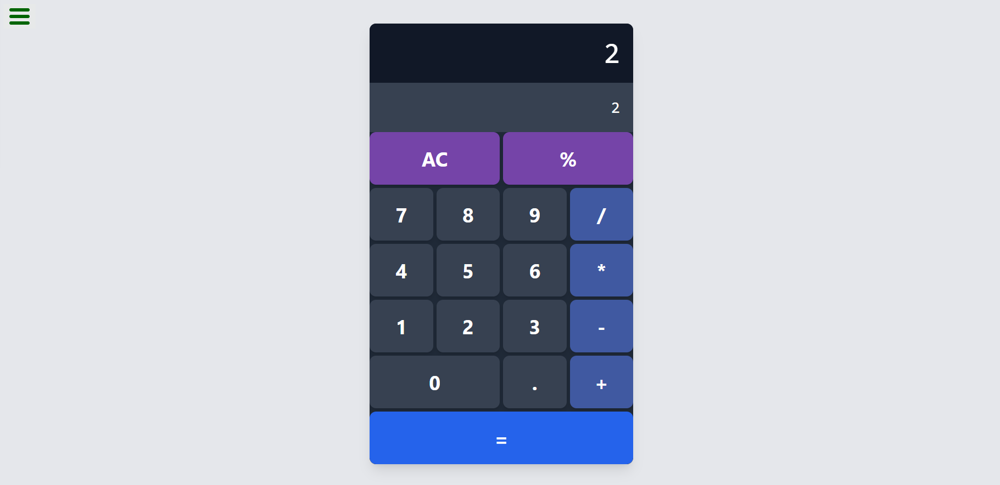

## JavaScript Calculator

This project is a React-based JavaScript Calculator that performs basic arithmetic operations, including handling sequences of operations with proper order of precedence. The calculator mimics the functionality of a standard calculator, including edge cases like handling negative numbers and multiple consecutive operators.

## Features

- Basic arithmetic operations: addition, subtraction, multiplication, and division.
- Handles multiple consecutive operators, following the rule that the last operator is performed unless the second operator is a negative sign.
- Correctly handles operations with negative numbers (e.g., `10 * -5` results in `-50`).
- Displays input and results on a responsive calculator interface styled to resemble a modern calculator.
- Provides a clear button to reset the calculator to its initial state.

## Technologies Used

- **React:** Frontend library for building the user interface.
- **Redux:** For managing the state of the calculator's operations and display.
- **Tailwind CSS:** For styling the components and creating a responsive design.

## Live Demo


You can view a live demo of the project [here](https://calculator--zohal-calculator-app.netlify.app/)

## Installation

To run this project locally, follow these steps:

1. **Clone the repository**:
   ```bash
   git clone git@github.com:ZohalMirkhel/javascript-calculator.git
   ```

2. **Navigate to the project directory**:
   ```bash
   cd javascript-calculator
   ```

3. **Install the Required Dependencies**:
   ```bash
   npm install
   ```

4. **Run the Project**:
   ```bash
   npm start
   ```

## Usage

1. Enter numbers and perform operations using the on-screen buttons.
2. Use the `=` button to calculate the result of the entered expression.
3. The calculator handles operations involving multiple operators, ensuring the last operator is applied correctly.
4. Use the `C` button to clear the current input and reset the calculator.

## Adjusting Styles

You can adjust the styling of the calculator by modifying the Tailwind CSS classes or adding custom styles in the `App.js` file.

## Contributing

If you'd like to contribute to this project, please fork the repository, make your changes, and submit a pull request. Contributions to improve the calculator's functionality, fix bugs, or enhance its design are welcome!


## Author

For any questions, feedback, or support, please contact me at:
- Email: [zohalmirkhel@gmail.com](mailto:zohalmirkhel@gmail.com)
- GitHub: [Zohal Mirkhel](https://github.com/ZohalMirkhel)
- LinkedIn: [Zohal Mirkhel](https://www.linkedin.com/in/zohal-mirkhel-840a7530a/)